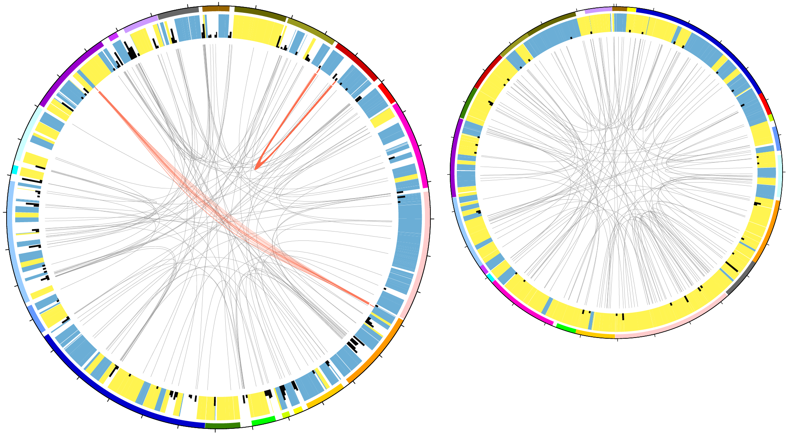
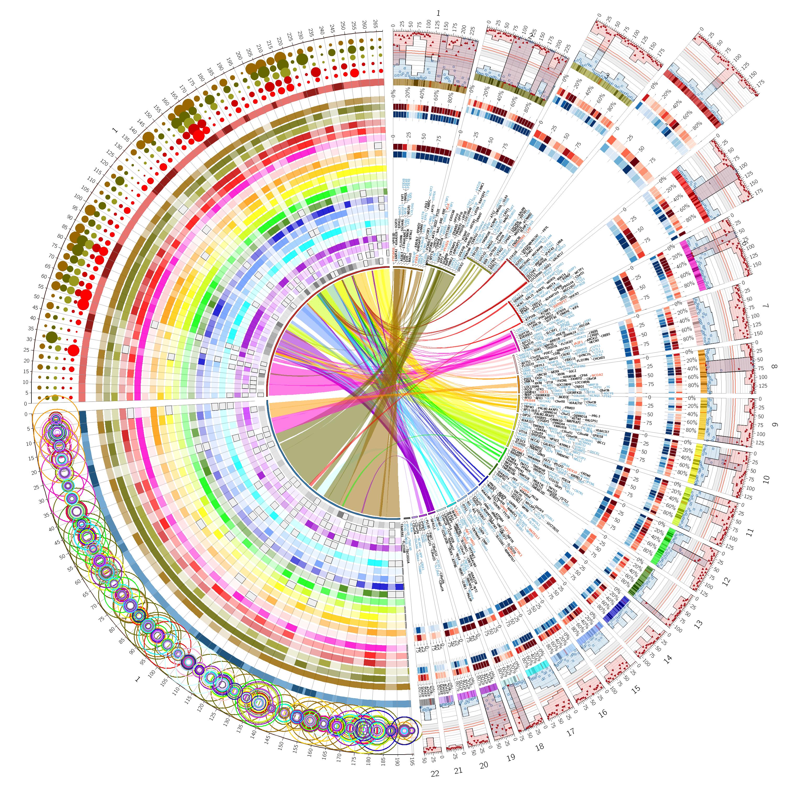
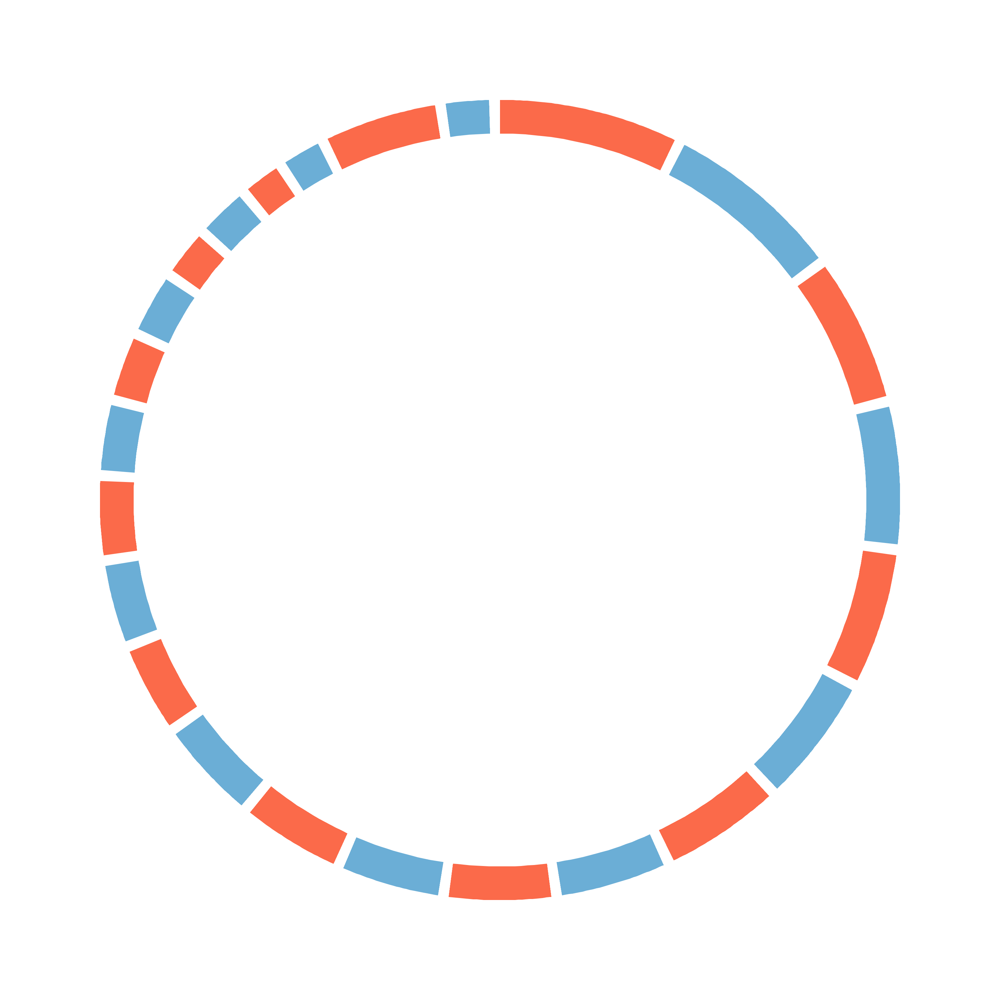
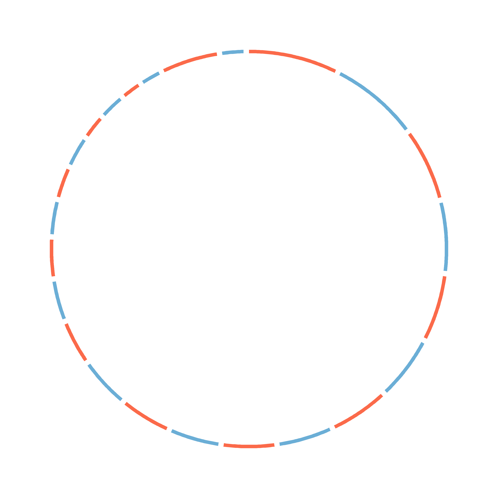
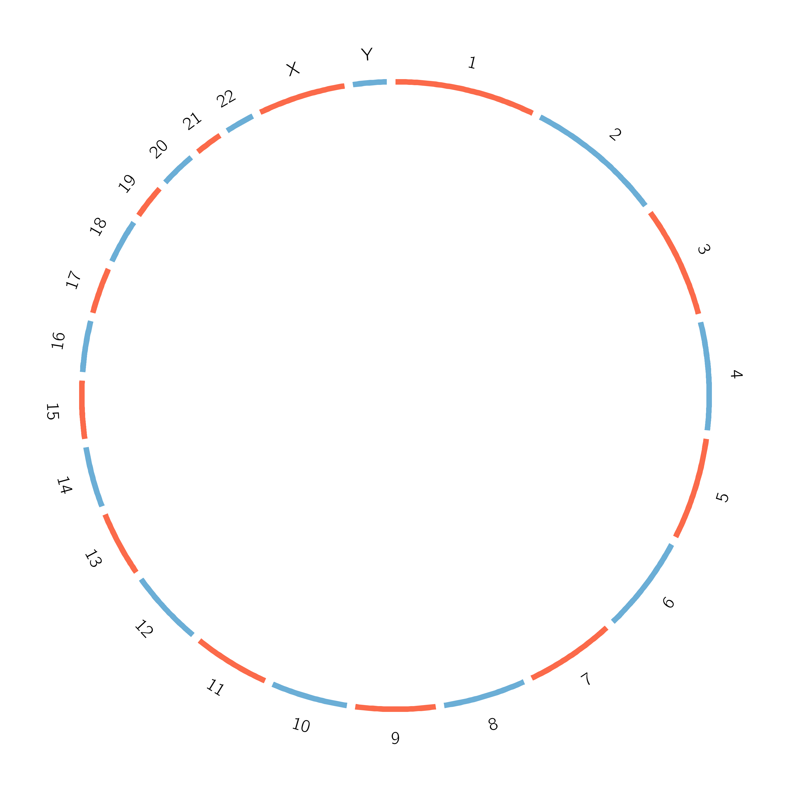
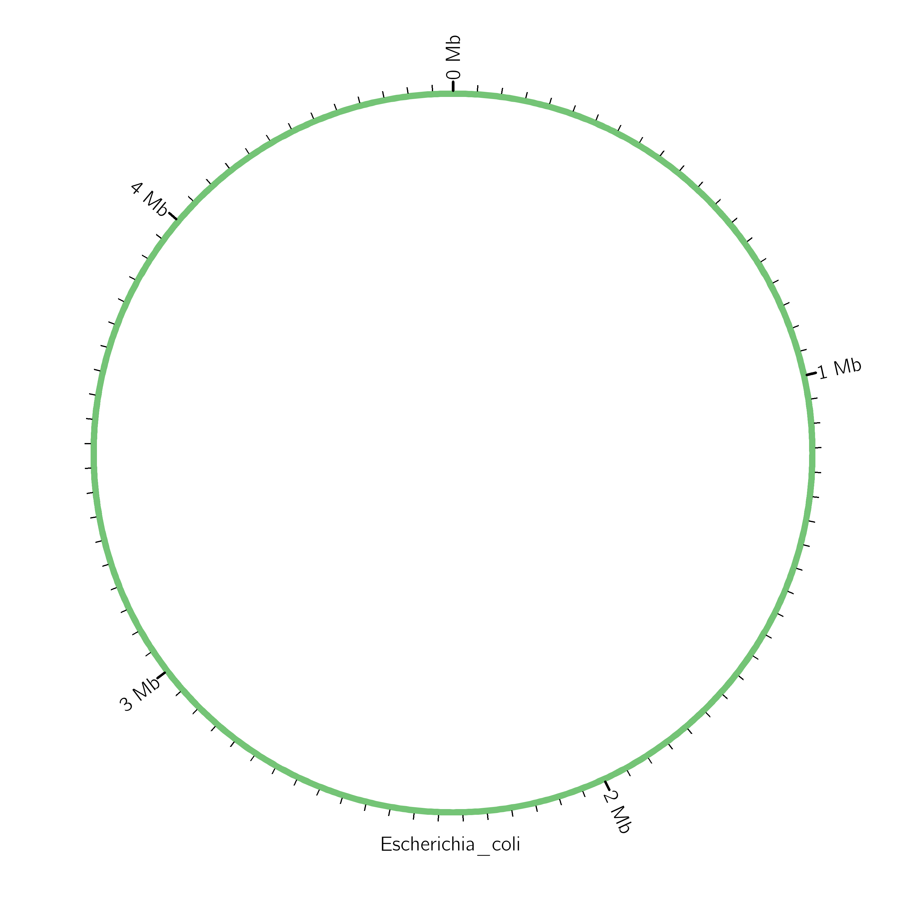
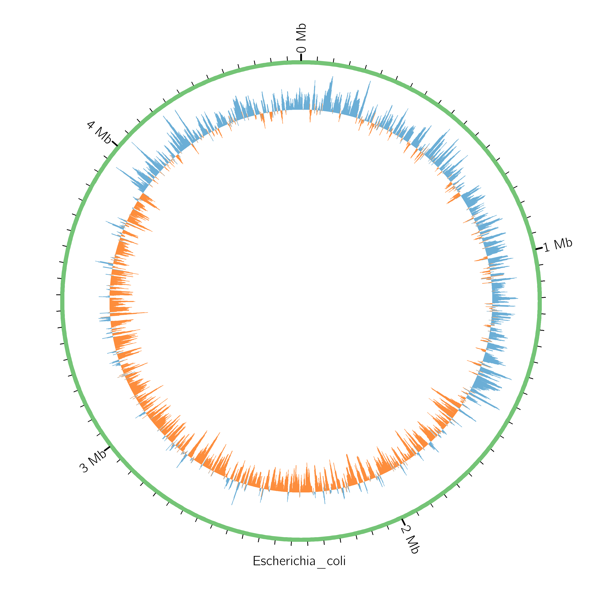
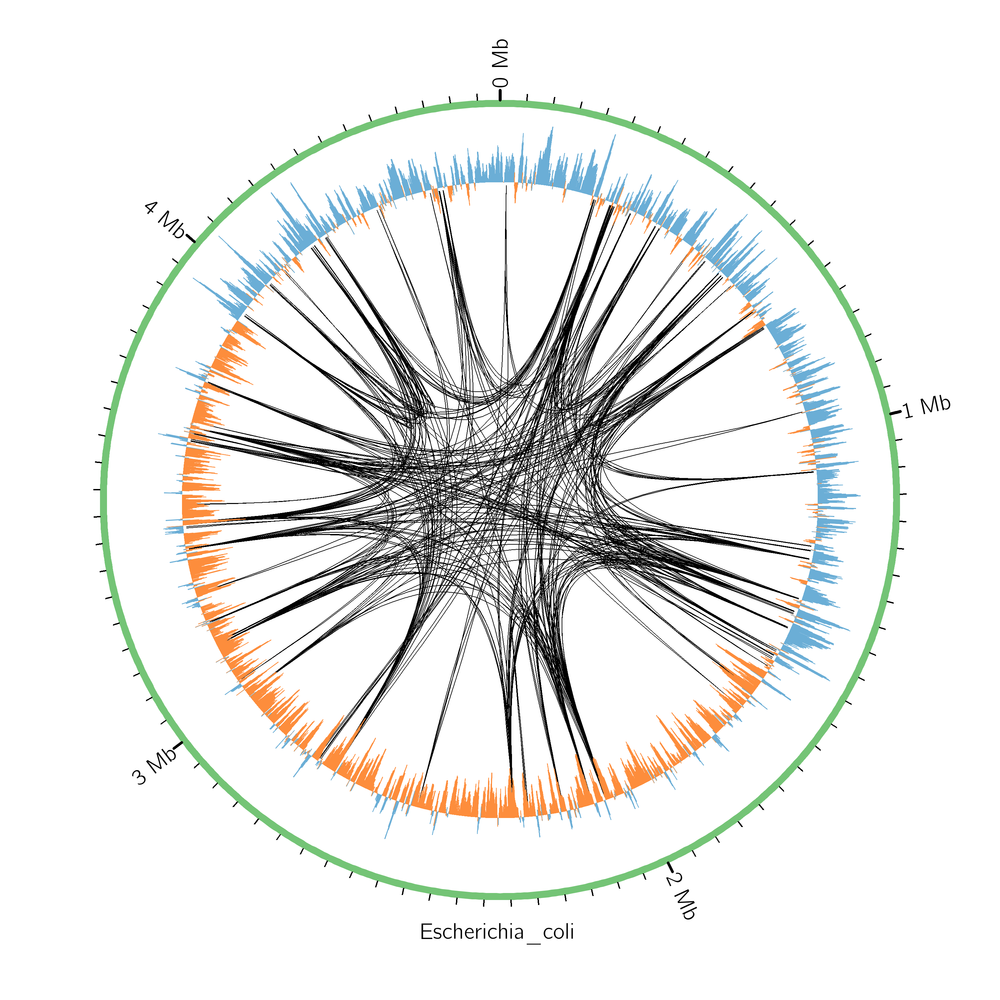

## Background
A significant challenge in dealing with large genomic datasets is being able to visualize them in an effective way. Generating informative and attractive figures is one of the most important things you can do to make your presentations and publications more impactful. If you look through genome papers, you will find that it is very common to generate circular images and summaries of genomic data. See the figure below summarizing two related bacterial genomes. When done properly, this can be very effective even in cases where you are working with genomes that are not circular themselves.



## Objectives
The goal of this exercise will be to use the program [Circos](http://circos.ca/) to generate publication-quality images from genomic data.

## Software and Dependencies

- Circos

To install circos [download and unpack the exercise materials](data/circos.zip). Then run the following commands in a bash terminal.

<pre class="bash"><code>cd circos
conda env create --file=circos_tutorial.yaml
conda activate circos_tutorial
</code></pre>

You can view the contents of the yaml file used to create this conda environment as follows:

<pre class="bash"><code>cat circos_tutorial.yaml</code></pre>


## Protocol

### 1. Generate the Circos figure from the example dataset distributed with the software
Before we get into the details of Circos, let’s see what it can do and confirm that the software is properly installed by generating the "example" figure based on the data distributed with the software.

Enter the following command to move into the directory with the relevant files for this exercise (where "circos" is the parent directory that you unpacked above.

<pre class="bash"><code>cd circos/example</code></pre>

Then run Circos by simply entering the name of the program. All the configuration files for this dataset are already in place in this directory, so no additional information is necessary as long as Circos is installed and in your PATH. We will go through how to set up these configuration files later.

<pre class="bash"><code>circos</code></pre>

The program should take about a minute to run and report a number of status updates along the way. It will return to the command prompt when finished. To see the figure that was generated, enter the following command.

**[Note that the `open` command used below and throughout this exercise assumes that you are working locally on a Mac OS X machine. If you are using a local linux machine, you can use `xdg-open`. If you are using a remote server, it will be easiest to transfer the image file to your local machine before viewing it.]**

<pre class="bash"><code>open circos.png</code></pre>

You should see something like this:



Whoa. One could argue whether a figure that "busy" could ever be informative. In truth, there are a lot of bad Circos figures that get published and convey little more than "we have a lot of data". But this example file is merely meant to give you a sense of the large amount of data that can be incorporated into circular figures and the many different ways Circos allows you to visualize those data. Let’s work through some of the steps required to convert genomic data into the input files Circos uses to generate figures like the one above (except simpler and more useful).

### 2. Set up circos.conf and karyotype files
The heart of a Circos run is the configuration file. When you call Circos, it will assume that a file with the name `circos.conf` is present in your current working directory. Otherwise, you can specify the name and location of your configuration file with the `-conf` option when you call Circos from the command line.

From your Terminal window, move into the exercise directory (where "circos" is the parent directory that you unpacked above).

<pre class="bash"><code>cd circos/exercise</code></pre>

Use `less` to view the contents of the configuration file.

<pre class="bash"><code>less circos.conf</code></pre>

This file contains some standard features that will always be present including references to some additional configurations that are distributed with Circos. It also contains parameters that you can set to alter the appearance of your figure. One key parameter is the one that defines the name and location of the karyotype file. That file defines the chromosomes that will be used for the figure.

Exit `less` by typing `q`, and then print the contents of the karyotype file to the terminal screen with the `cat` command.

```{bash}
cat karyotype.human.txt
```

You should see that the chromosomes are defined by each of line of text, which are presented in the following format:

chr - ID LABEL START END COLOR

The columns should be largely self-explanatory. Note that the difference between ID and LABEL is that ID is what you will refer to in other data and configuration files, whereas LABEL is the text that will be put on the figure. START and END refer to chromosome lengths (typically in bp), and COLOR defines the color used for that chromosome in the figure.

### 3. Generate a circular representation of the human genome

Run Circos in your current directory (`exercise`). 

<pre class="bash"><code>circos</code></pre>

Once the run has completed, open the output. You should see that it updates to the following image. These are the 24 human chromosomes (including the 22 autosomes and both the X and the Y chromosome) that were defined in the karyotype file.

<pre class="bash"><code>open circos.png</code></pre>




### 4. Modify thickness of the chromosomes
Now let’s try making some modifications. Launch a text editor such as BBEdit that can connect to a remote server and open the following file: `~/circos/exercise/circos.conf`

Many of the parameters that define how the figure is displayed are found within the `<ideogram>` block. Change the thickness parameter so that it reads: 

> thickness = 20p

Save that change to the text file and re-run Circos.

<pre class="bash"><code>circos</code></pre>

You should see the thickness of the chromosomes has been reduced in the updated figure (you may have to re-open the `circos.png` file).



### 5. Add labels for each of the chromosomes
In your text editor, paste the following text into the `circos.conf` file anywhere between the `<ideogram>` and `</ideogram>` lines.

> show_label       = yes  
> label_font       = default  
> label_radius     = 1r + 75p  
> label_size       = 50  
> label_parallel   = yes  

Save the file and re-run Circos from the command-line.

<pre class="bash"><code>circos</code></pre>

Verify that your figure has been updated to add labels for each chromosome.



### 6.	Visualize the single chromosome of a bacterial genome and add label positions
In your text editor, change the karyotype line in the circos.conf file so that it reads:

> karyotype = karyotype.ecoli.txt

If you save that change and re-run Circos, you should see a rather dull-looking green circle. Let’s add some tick marks to the outside of the genome to indicate position. Use `cat` to view the contents of the ticks.conf file in the current directory 

```{bash}
cat ticks.conf
```

This file sets various parameters for how to display ticks around the circle. These particular settings will display big, labeled marks every 1 Mb and small, unlabeled marks every 50 kb. Let’s add these ticks to our figure, but instead of copying the whole body of text into our main configuration file, we can just add the following line at the top of circos.conf.

> \<\<include ticks.conf\>\>

Note that this is a general strategy. Rather than have one configuration file get bigger and bigger, you can refer to additional files in your main configuration file to keep your project more organized. If you save this change and re-run Circos, you should see the following updated image.

<pre class="bash"><code>circos</code></pre>



###	7. Add GC skew data to the plot 
Our bacterial genome plot is still pretty boring. Let’s add some information about the genome. GC skew is a measure of strand-biased nucleotide composition that is defined as $(G - C)/(G + C)$, where $G$ and $C$ are the number of guanines and cytosines in one strand of DNA. GC skew can be very valuable in identifying the origin of replication in bacterial genomes.

The `gc_skew.txt` contains calculated GC skew values in a 5-kb sliding window with a 1-kb step size. It is formatted for Circos such that positive GC skew values will be shown in blue and negative values will be shown in orange. The "main"" term simply refers to the name of the chromosome in the *E. coli* karyotype file. You can print the first 10 lines of the output file with the `head` command (you can also explore the entire file with `less`). You should see that each line specifies a location in the genome and a corresponding GC skew value.

```{bash}
head gc_skew.txt
```

We can visualize these data in our figure by adding a `plots` block to our main configuration file. In your text editor, paste the following lines after the `</ideogram>` line near the end of the `circos.conf` file. 

> \<plots\>  
> \<plot\>  
> type = histogram  
> file = gc_skew.txt  
> extend_bin = yes  
> thickness = 0  
> r0 = 0.6r  
> r1 = 1.0r  
> orientation = out  
> min = -0.2  
> max = 0.2  
> \</plot\>  
> \</plots\>  

If you save these changes, and re-run Circos, you should see the following updated figure.

<pre class="bash"><code>circos</code></pre>



Do you have a guess as to where the origin of replication and termination of replication are in *E. coli*?

We have just added a histogram "track" to our Circos plot. But these tracks can take on many forms:

-	Histograms
-	Scatter plots
-	Line plots
-	Heat maps
-	Tiles (*i.e.*, stacking elements like read mapping)
-	Text labels
-	Glyphs (*i.e.*, symbols)

### 8. Identify repeats within the genome with links
Circular genome representations can be very useful for drawing connections between different parts of a genome. For example, they are very effective at visualizing repeated sequences. Let’s show the locations of repeats within the E. coli genome. The `blast_repeats.txt` file summarizes all self-blast hits within the *E. coli* genome that are at least 1000 bp long and have at least 90% nucleotide sequence identity. Once again "main" simply refers to the name of the chromosome in the *E. coli* karyotype file. You can use head to print the first 10 lines of the blast_repeats.txt output file.

```{bash}
head blast_repeats.txt
```

Each pair of lines specifies the connection points for the given repeat pair.

We can visualize these data with Circos by adding a `links` block to our main configuration file. In your text editor, paste the following lines after the `</ideogram>` line in the `circos.conf` file. 

> \<links\>  
> radius = 0.8r  
> bezier_radius = -0.1r  
> bezier_radius_purity = 0.9  
> crest = 0.5  
> perturb = yes  
> perturb_crest = 0.9,1.1  
> perturb_bezier_radius = 0,2  
> perturb_bezier_radius_purity = 0  
> \<link singles\>  
> z = 0  
> show = yes  
> color = black  
> thickness = 2  
> file = blast_repeats.txt  
> \</link\>  
> \</links\>  

In Circos, links are simply curved lines that connect two points ([Bézier curves](https://en.wikipedia.org/wiki/Bezier_curve)). The above parameters largely determine how "bendy" you want those curves to be and whether you "perturb" them so that similar connections do not overlap quite so much.

If you save these changes, and re-run Circos, you should see the following updated figure.

<pre class="bash"><code>circos</code></pre>




In this case, our repeats are very small relative to the size of the whole genome, so we are using simple links, which essentially represent a connection between points. But if you want to show connection between larger elements, you can use "ribbons" in Circos such that the width of the connect line reflects the size of each region.

### 9. Explore the Circos tutorials
We have barely scratched the surface on the diverse visualization options in Circos. Even for the code we have used in some of these examples, we have not gone into detail on many of the parameters. As time allows, try out some of the tutorials described in the [Circos website](http://circos.ca/documentation/tutorials/).
