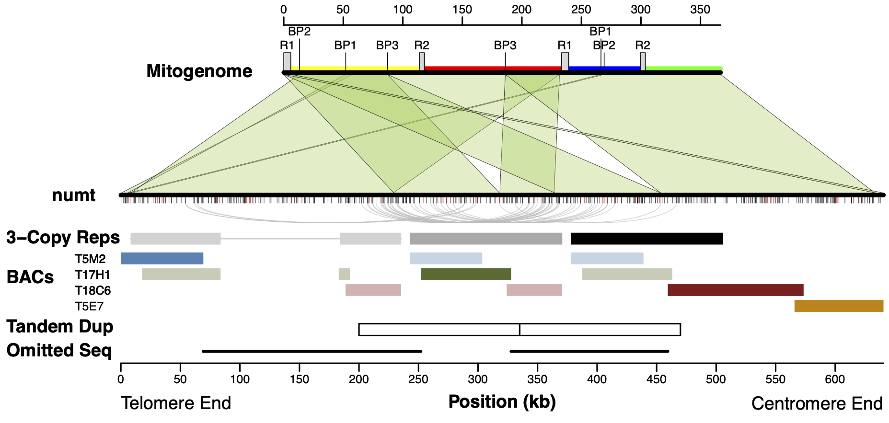
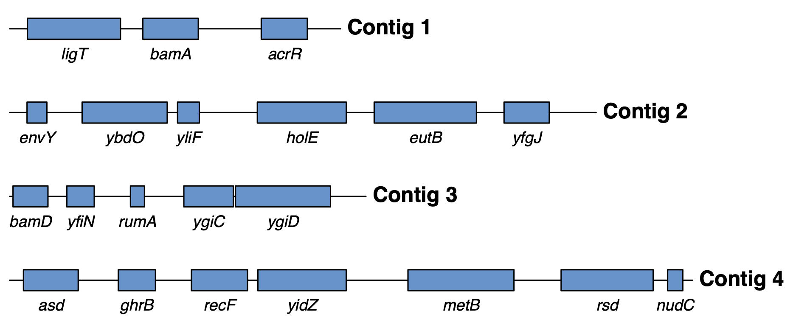

## Background
Generating graphics is a central component of scientific communication that is important in both written publications and oral presentations. Many researchers are accustomed to manually “drawing” figures using program such as Inkscape, Adobe Illustrator, or Microsoft PowerPoint. These are valuable tools, but in cases where graphics are meant to accurately represent quantitative data, there are benefits to using a coding language. You are  familiar with [R as a statistical language](https://www.r-project.org/) and a resource for generating plots and graphs. But R can also be used for drawing shapes and graphics. Some of the advantages of using R in this context are:

- The ability to generate and save code/scripts that will make it efficient to produce new figures based on related datasets or modified versions of the same figure without starting from scratch each time.

- The ability to imbed these steps into larger scripts or pipelines and avoid laborious manual work.

- The ability to be precise and accurate with placement of objects to faithfully represent the data.

\


Other relevant tools for figure design that we will not be using in this class but are good to be aware of.

- [Processing](https://processing.org/): alternative coding language for data-rich visualizations

- [Circos](http://circos.ca/): A tool for generating data-rich diagrams and plots in a circular format that is often used for visualizing genomic data.

- [Adobe Illustrator](https://www.adobe.com/products/illustrator.html): manual creation and manipulation of image files with vector elements (subscription-based)

- [Inkscape](https://inkscape.org/): Free, open-source alternative to Adobe Illustrator

- [BioRender](https://biorender.com/): Web tool for designing biological illustrations (subscription-based)

- [ggPlot](https://ggplot2.tidyverse.org/reference/ggplot.html): For this exercise, we will work in the base R package. There are pros and cons to usisng base R functions as opposed to ggPlot (which is the standard for generating graphs and plots). So be aware that some ggPlot geomitries like `geom_polygon`, `geom_line`, and `geom_text` can be used to accomplish some of the same goals in this exercise.

## Slides
Slides from today's presentation are [available for download here](DataVisualizationII.pdf).

## Objectives

- Learn some of the syntax for drawing objects in R
- Draw a simple gene map to apply some of the basic R functions

## Software and Dependencies
- R
- Optional: Rstudio

## Protocol

### 1.	Open R console and use it to draw shapes with the `polygon` function


Launch an R or RStudio console session, and create a canvas for yourself by entering the `plot.new()` command:

<pre class="r"><code>plot.new()</code></pre>

Now, let’s use the `polygon` function to create a simple shape. When calling this function, the minimum necessary information to provide is a vector of x-coordinates and a vector of y-coordinates. For example, the following command should generate a rectangle that is 0.2 units long and 0.7 units high, with its lower-left hand corner at the origin. Note that the order of the points is important because the outline of the shape will be traced in the order that the points are listed.

```{r echo=2, fig.align='center'}
plot.new()
polygon(c(0, 0, 0.2, 0.2), c(0, 0.7, 0.7, 0))
saved_plot = recordPlot()
```
After entering that command, you should see the outline of a rectangle appear in your plot window (see above).


Now enter two more polygon commands.

```{r echo=2:3, fig.align='center'}
saved_plot
polygon(c(0.3, 0.4, 0.5), c(0.05, 0.4, 0.05), lwd=4)
polygon (c(0, 0.1, 0.5, 0.5, 0.1), c(0.4, 0.5, 0.5, 0.3, 0.3), col="chartreuse4")
saved_plot = recordPlot()
```
You should see two more shapes appear in your plot window: a triangle and an arrow-like pentagon. Note that we have also added an additional parameter to each of these function calls. The `lwd` parameter is used to set the line-weight. Notice that we have increased it above the default value of 1, creating a thicker line around the triangle. The `col` parameter sets the fill color for the object, and we have used it to make the pentagon green.

To learn more about options and parameters, try exploring the par documentation in R by entering the following at the R command prompt:

```{r}
?par
```

Finally, note that the green polygon is partially covering the triangle. This reflects the general rule that objects that are added later to the plot will be placed on top of others. This can be important for constructing complex or layered images.

### 2. Use the `segments` and `text` functions to add lines and labels to your plot

The `seqments` function is valuable for adding simple lines to a plot. Enter the following command to try it out. The first two values specify the x and y coordinates (respectively) for the start of your line segment. The third and fourth values specify the x and y coordinates for the end of your line segment.

```{r echo=2, fig.align='center'}
saved_plot
segments (0.3, 0.1, 0.8, 0.2, col="steelblue", lwd=2)
saved_plot = recordPlot()
```


Finally, let's print some text onto our plot. The `text` function is useful for doing this. Enter the following command to try it out. The first two arguments specify the x and y coordinates (respectively) to place the text.

```{r echo=2, fig.align='center'}
saved_plot
text (0.7, 0.7, "CM 515 Abstract Art")
```

\
\


With some coding and a some input data, the above commands (`polygon`, `segments`, and `text`) can be used to build custom, data-rich figures like the following.

\
\

 
\
\
\

## Assignment

Use the functions described in the first part of this exercise to create a map of gene locations on four assembled genome contigs with the following input data files.

- [gene_map.txt](data/gene_map.txt)
- [contig_lengths.txt](data/contig_lengths.txt)

\
\

Aim for a final figure that looks something like the following. But it does not need to be an exact replica. Employ your own R coding solutions to achieve the general goal.

 
 
 
Some hints for tackling this assignment:

- The dimensions for a canvas specified with new.plot() are 1 x 1, so think about how to scale values to fit in a 1 x 1 space. For example, consider defining and then dividing by the maximum base-pair coordinate.

- You will want to draw a line segment for each contig and a rectangle for each gene. But you definitely do *not* want to repeat the `segments` and `polygon` code over and over again for each contig and gene. This would be a good time to learn/practice [for loops in R](https://www.w3schools.com/r/r_for_loop.asp).

Submit your **completed drawing and R code** via Canvas.